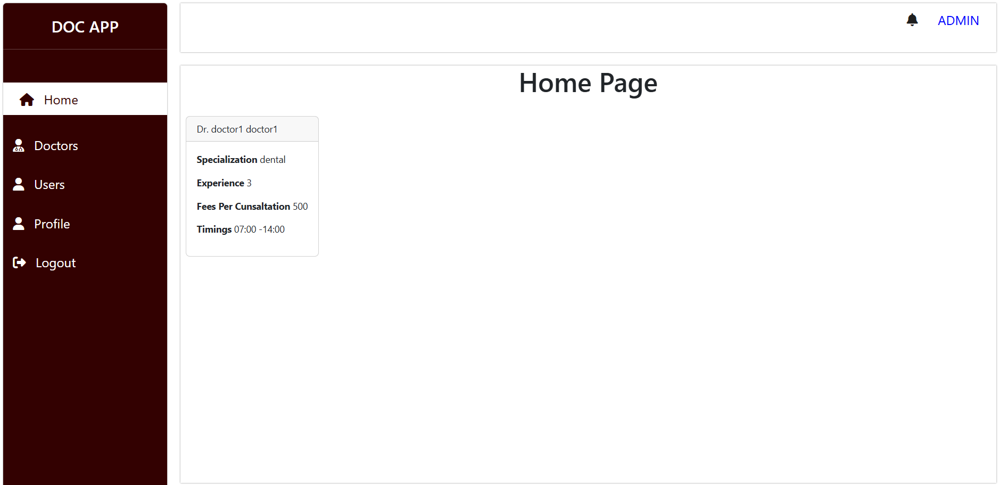
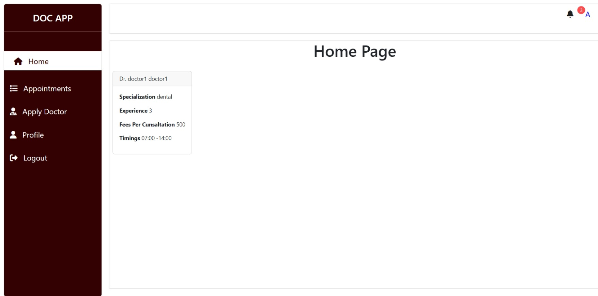

# 💻 Dự án: Phát Triển Website Đặt Lịch Hẹn Với Bác Sĩ

Hệ thống web hỗ trợ quản lý việc đặt lịch khám bệnh với các chức năng chính:

- 👤 Người dùng: Đăng ký tài khoản, đăng nhập, đặt lịch khám.
- 🩺 Bác sĩ: Gửi yêu cầu xét duyệt trở thành bác sĩ, quản lý và xác nhận lịch hẹn.
- 🛠️ Quản trị viên (Admin): Duyệt yêu cầu trở thành bác sĩ, quản lý tài khoản người dùng, khóa/mở khóa tài khoản.

## 🖼️ Giao diện demo

### Trang chủ Admin


### Trang chủ Bác sĩ


### Trang chủ Người dùng


## 🚀 Cài đặt

```bash
npm install
npm run dev
